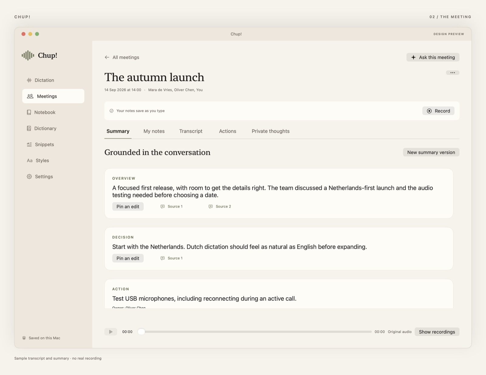
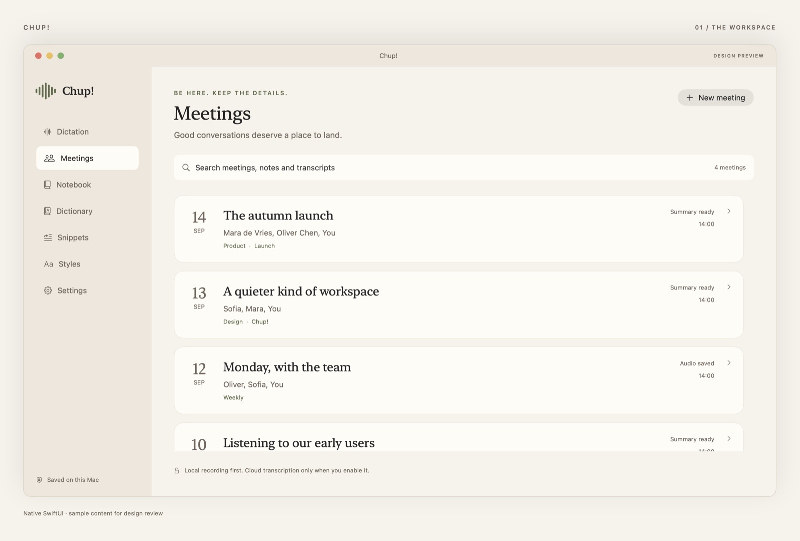
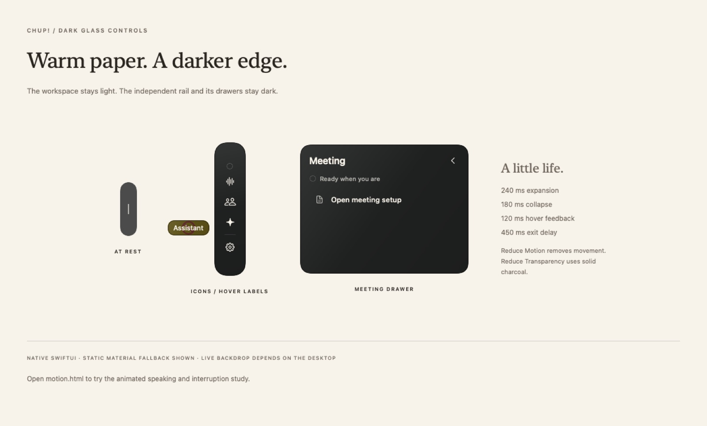

# Chup!

Dictation and meeting notes for the Mac. Hold a shortcut and talk, and the text lands in whatever app you're typing in. Start a meeting and Chup! records it on your Mac, transcribes it, and keeps a summary and a list of actions that point back to the moments they came from. Native SwiftUI and AppKit, macOS 15 or later on Apple silicon.



<details>
<summary>More screens: the meetings list, the Dynamic Island and the floating rail</summary>





</details>

Skype made the phone call free and the telcos never recovered. Local speech models have done the same to transcription: the cost of turning an hour of audio into text has gone to roughly zero, so the only question left is where the audio goes. Most meeting note tools answer that by uploading everything. Chup! keeps it on the machine that recorded it.

- **Recording stays on your Mac.** Audio, transcripts and notes live in an encrypted local library. Cloud transcription and summaries run only when you turn them on, through a backend you host.
- **Dictate anywhere.** Local Whisper models or the cloud. Chup! applies your personal dictionary and snippets, and you can review the text before it's pasted.
- **Summaries show their sources.** Every point in a summary links to the part of the transcript it came from. Your own edits survive when the summary is regenerated.
- **It stays out of the way.** The controls sit in the notch or on a thin rail at the edge of the screen, and nothing takes focus from the app you're in.

**Status: development preview.** The app builds and ships, but it is not production-complete. Private voice and assistant broadcast are route-gated prototypes, and physical audio routing and provider access have not been qualified. Read [implementation status](docs/STATUS.md) before you record something you can't repeat.

## Install

Download the `.dmg` from the [latest release](../../releases/latest) and drag Chup! into Applications. Every push to `main` becomes a Developer ID signed, notarized release. The app checks for updates every hour and has **Check for Updates…** in its menu bar menu. See [Releases and updates](#releases-and-updates).

## Build and run

You need Xcode 27, Apple silicon, macOS 15 or later, XcodeGen, and Node 22 or later for the optional backend.

```sh
xcodegen generate
open Chup.xcodeproj
```

Choose the `Chup` scheme, My Mac, and a signing team if you want to test permissions. Run with Command-R. The checked-in `.xcodeproj` works without regenerating it. ChupCore is a local Swift package with vendored SQLCipher on Apple CommonCrypto. The first app build resolves the pinned WhisperKit dependency through SwiftPM, and the core package stays self-contained. See [dependency provenance](docs/DEPENDENCIES.md).

For a compile-only build without signing:

```sh
./scripts/build.sh
./scripts/test.sh
./scripts/render-design.sh
open Design/index.html
```

XcodeBuildMCP 2.7.0 was used through its CLI. To reproduce:

```sh
npm install --prefix .tools --no-audit --no-fund xcodebuildmcp@2.7.0
.tools/node_modules/.bin/xcodebuildmcp macos build \
  --project-path "$PWD/Chup.xcodeproj" --scheme Chup \
  --derived-data-path "$PWD/.artifacts/DerivedData" --extra-args CODE_SIGNING_ALLOWED=NO
```

A project-local `.codex/config.toml` registers the MCP for trusted sessions. Global Codex configuration was left alone.

## Install each iteration

Run `python3 scripts/deploy-local.py` after you finish an iteration and its checks. It builds `Chup!.app` with the commit count as its build number, signs it with Developer ID (Apple Development if that is all you have), validates the app with the offline native fixtures and installs it at `/Applications/Chup!.app`. The installed copy is checked again. Earlier versions are kept under `.artifacts/InstalledBackups` and the latest successful installation is recorded in `.artifacts/last-install.json`.

The command will not force-quit Chup!, start a microphone, enable login items or install the virtual audio driver. Close Chup! yourself before replacing a running version. `--applications-dir "$HOME/Applications"` installs into the per-user Applications folder and `--signing-identity` picks another configured local identity. A development install like this is separate from notarization and App Store distribution.

## The AI backend

Local recording, typed notes and dictation with an installed model work without this service. Meeting transcription, summaries and AI editing use the cloud when you enable them.

```sh
cd backend
npm ci
cp .env.example .env
# Edit .env locally: OpenAI project key + a separate randomly generated app token.
# Generate a token with: openssl rand -hex 32
npm start
```

In the app, open Settings → Advanced, enter `http://127.0.0.1:8787` and the **app token**, then save the token in the Keychain. The OpenAI project secret stays in the backend's `.env` and never goes into the app. Turn on cloud processing under Privacy. Live captions have their own toggle under Meetings. The included service binds loopback only and is a development relay, so a production deployment needs HTTPS, real per-user authentication, quotas and monitoring.

Models: `gpt-live-1` for the Live transport spike, `gpt-live-transcribe` for live captions, `gpt-4o-transcribe-diarize` for final file segments, `gpt-transcribe` for dictation, and a configurable `gpt-5.6-luna` for cleanup, summaries and questions. The names and contracts were checked against the current official documentation. No account-level requests were made here. See [API research](docs/API-RESEARCH.md).

## Try it

- Create a meeting note. Type notes and every write commits immediately. Record opens a picker for the microphone alone or a specific application. Tell the participants. Pause does not mute the conference app.
- Stop, then choose Transcribe saved audio. Completed chunk jobs survive a retry. Rename or correct speakers in the transcript, then generate a summary that cites its sources.
- Settings → Shortcuts holds several bindings per action: keep Fn and add Control–Shift for an external keyboard. Edit or remove each binding on its own and the change persists at once. Grant Input Monitoring and Accessibility from Settings. Use the default preset or the one without Fn, and set the Fn key's macOS behaviour to match. Dictation writes into the original field only while its identity, focus epoch, content and selection still match.
- Meeting detection reads Core Audio activity metadata for known apps. Its prompt takes no focus, dismisses after ten seconds, deduplicates and can snooze for two minutes. Accepting starts recording. Browser detection is a heuristic and cannot tell tabs apart.
- Ask a meeting a question in private text. Proposed note writes are shown before they land. Save commits with a request ID and an expected version, and Undo never overwrites newer edits.

## Your data

`~/Library/Application Support/Chup/` holds the **Chup!** library. The app and its Keychain service use `com.chup.mac`, with no legacy identity or data-directory fallback. SQLCipher encrypts metadata, search indexes, notes and request journals, and a separate Keychain key encrypts audio and reference files. Earlier plaintext databases migrate when opened. Settings offers opt-in retention, deletion, readable JSON export and password-protected backup and restore. See [setup and recovery](docs/SETUP.md).

The backend caches encrypted provider results so retries survive, with its own retention and deletion, and it logs neither meeting text nor audio. Login items, voice enrollment, the virtual driver, bots and cloud sync all stay off until you turn them on.

[Product specification](docs/PRODUCT.md) · [Architecture](docs/ARCHITECTURE.md) · [Phased backlog](docs/PLAN.md) · [Validation and manual steps](docs/VALIDATION.md)

## Design and motion previews

Open [the design gallery](Design/index.html), or view [Meetings](Design/Previews/01-workspace.png), [meeting detail](Design/Previews/02-meeting.png), [notification panels](Design/Previews/03-panels.png), [the dark glass rail](Design/Previews/04-dark-glass-rail.png), [speaker controls](Design/Previews/09-speakers.png), [meeting actions](Design/Previews/10-actions.png), [private voice](Design/Previews/11-private-voice.png), [onboarding](Design/Previews/12-onboarding.png), [permissions](Design/Previews/13-permissions.png) and [storage settings](Design/Previews/14-storage.png). Sample content appears only on the explicit `--render-design` path and uses a temporary database. A normal start is empty.

[Design/motion.html](Design/motion.html) shows the light workspace and the animated dark glass rail. Try Listening, Speaking, Interrupt and the ten-second meeting prompt. [The MP4](Design/Previews/06-motion.mp4) and [GIF](Design/Previews/06-motion.gif) walk through it without the app. They are labelled design demonstrations with no audio connection. See [motion and validation notes](docs/MOTION.md).

The red scanner waveform icon comes as a [1024 px master](Design/AppIcon-master.png), a [layered Icon Composer document](App/Resources/ChupIcon.icon) and legacy size variants. See [icon notes](Design/ICON.md).

## Where things stand

[Implementation status](docs/STATUS.md) is the current picture and [validation](docs/VALIDATION.md) records what was tested and how. The iteration notes trace how it got here: [iterations 1–3](docs/ITERATIONS-1-3.md) for capture recovery, dictation and transcript and speaker work, [iterations 4–6](docs/ITERATIONS-4-6.md) for meeting intelligence, private voice and assistant routing, [iteration 7](docs/ITERATION-7.md) for encrypted storage, retention, backups and onboarding, and [phase 8](docs/PHASE-8.md) with its [manual acceptance checklist](docs/MANUAL-TESTS.md) for provider checks. Local dictation is covered in [the local transcription investigation](docs/LOCAL-TRANSCRIPTION.md).

Real provider access, physical recording and privacy routing are still unqualified. Two scripts help with the pieces that need no hardware:

```sh
python3 scripts/test-live-transport.py  # after building; no OpenAI or audio hardware
python3 scripts/build-virtual-mic.py   # builds a separate driver; never installs it
```

The virtual audio driver has its own licence and an explicit development install, described in [driver setup and qualification](DriverPrototype/README.md). Ordinary meeting recording does not need it.

## Releases and updates

Every push to `main` on [Kunba-Labs/chup](https://github.com/Kunba-Labs/chup) runs `.github/workflows/release.yml` on a GitHub macOS runner. It builds arm64 Release as **1.0.<commit count>**, signs it with Developer ID, notarizes and staples the DMG, and publishes it as a GitHub release with `appcast.xml`. Any copy in an Applications folder checks that appcast every hour through Sparkle and has **Check for Updates…** in the menu bar. That includes `deploy-local.py` installs, which carry the same Developer ID signature and commit-count build number. No update is offered while you're recording or dictating. Xcode runs from DerivedData never update themselves.

`scripts/release-secrets` puts the signing, notarizing and Sparkle secrets on the repo. The Sparkle private key lives in `~/Desktop/chup-updater-key`. Back it up. Losing it strands every installed release.
