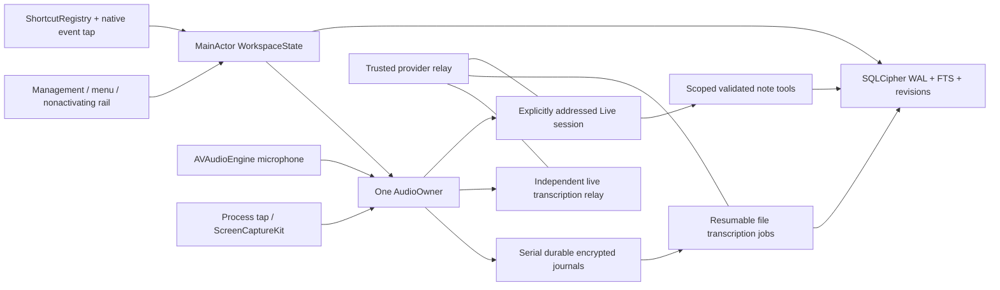

# Architecture

## Boundaries

ChupCore contains portable state contracts, SQLite repository, authenticated journal framing, evidence validation, shortcut resolver, speaker overlays and privacy routing policy. App uses AVFoundation/CoreAudio/AppKit; it alone owns permissions, focused AX targets and playback. Backend is a small Node service, never a capture dependency. No production API key in the bundle. Network consumers receive already journaled data; network backpressure drops live updates, never durable recording.

SQLite uses WAL, FULL synchronous transactions and FTS5. Notes have monotonically increasing versions and mutation receipts. Reusing a request ID with a different payload fails; duplicate same request returns the committed receipt. Version mismatch fails before writes. Undo makes a new revision and respects subsequent edits. Summaries and transcripts retain revisions; human corrections overlay provider output. Source IDs belong to the selected meeting. Evidence validation checks IDs, quote inclusion and source availability; semantic entailment remains a separate model/human verification gate.

## Capture and recovery

Microphone graph lifecycle: every restart creates a fresh AVAudioEngine, binds the requested device and installs its tap with the hardware input-scope format. The small Objective-C `CAudioSafety` module contains the AVFAudio setup/teardown boundary; framework exceptions become startup NSError values before crossing Swift concurrency frames. This is intentionally limited to native audio calls, not a generic exception wrapper around Swift. Configuration callbacks validate current device/rate/channels/running state on the main queue before pausing, and engine teardown does not occur inside the framework notification handler. Existing consumer leases fence stale packets during replacement.

One owner fans the physical mic to meeting and dictation. Concurrent dictation is still audible to conference software that reads that mic, and is recorded as microphone material. Remote audio never goes into dictation or assistant input. Track journals are append-only length-framed AES-GCM records containing timestamp, format and PCM. Flush at bounded intervals and close at pause/stop. A truncated final record is recoverable; authentication corruption fails closed. Rotation limits upload memory and file size. Wall time and monotonic host time are separate; sleeping creates a gap and pauses recording. Device loss creates a new leg, never quietly changes the selected remote process.

Process taps use private aggregate devices, which are NOT a public microphone. ScreenCaptureKit fallback is explicit because it has a different permission surface. Browser PID selection can capture several tabs and helpers; never promise tab isolation. Live text has capture-window timings and provisional source labels, not word timings or acoustic speaker confidence. Final uploads use overlapping, bounded windows and request-scoped speaker IDs. Matching content within the same captured audio interval can link a group conservatively; text similarity across disjoint intervals never proves identity. Person attribution requires manual assignment or a visibly provisional enrolled-reference match. Provider and manual revisions are separate, and changed segmentation opens a review gate. See ITERATIONS-1-3.md for transaction and enrollment details.

## Assistant routing

Private text has no audio side effects. Private voice outside a meeting uses explicit hold/Ask. During a call it remains blocked without verified input isolation (a user checkbox cannot establish platform mute). Broadcast graph: physical mic + assistant → controlled virtual mic; remote → recorder/headphones only. Assistant → separate journal + headphones. Gate playback in code; clear queued speech and recreate session when scope changes. Track frames actually rendered, not generated transcripts. Cancellation of speech and cancellation of backend work are separate operations.

BlackHole is a prototype candidate only: GPL-3.0 and commercial licensing implications require resolution before bundling; installer modifies /Library/Audio/Plug-Ins/HAL and may require restart. No driver installation for ordinary capture. A dedicated AudioServerPlugIn is an alternative, with a separate signed installer and extensive audio qualification. A named meeting participant requires platform integration/bot, not a virtual mic.

## Security

Treat transcript, selected text, notes and retrieved material as untrusted evidence. Only a foreground Ask/hold action can create a tool authorization scope; passive capture cannot. No send/email/delete external tools. Bounds-check all provider timing/IDs. Server binds loopback by default, requires a separate app token, caps uploads, restricts WebSocket event types and never logs audio or secrets. Production must add user auth, TLS, quotas and deployment observability. Personal voice references require explicit enrollment, revocable keys and deletion before enabling recognition.

## Iterations 4–6 service boundaries

`WorkspaceIntelligence` coordinates versioned summaries, live outlines, private thoughts and action receipts. `WorkspaceStore.saveSummaryRevision` validates and commits the summary/version in one SQLite transaction; action writes also enforce meeting identity, optimistic versions and idempotency. Backend `intelligence.mjs` owns extraction, chunk retrieval and evidence review behind injectable structured completion.

`WorkspaceVoice` owns an addressed `VoiceTurnScope`, capture subscription, routing gates and durable delegation results. `LiveConversation` coordinates transcript/delegation lifecycle; `LiveSession` owns the distinct Live WebSocket protocol and acknowledged input controls. The app sends microphone data only while addressed. `AudioOwner` fans out immutable packets to independent journals, captions, voice and outgoing consumers, with a capture-time private flag so queued private packets cannot leak into the meeting journal after unmute.

`AssistantAudioRouter` checks HAL device/process evidence and controls two `VoiceOutputEngine` instances: pinned local headphones and the outgoing virtual device. `VoiceRenderQueue` rejects old contexts; `VoiceRenderSink` records the consumed assistant branch before final mixing. The outgoing mixer accepts physical mic and assistant only. Driver buffering, actual remote delivery and speaker echo cancellation remain outside the currently verified boundary. Voice interruption revokes playback independently of durable backend/tool work.

Private thoughts are never provided to AI. Broadcast scopes omit personal notes/history and receive only the shared transcript plus a new explicitly addressed question. HAL polling is a detection mechanism, not an atomic privacy guarantee. See ITERATIONS-4-6.md and DriverPrototype/README.md for the remaining route qualification.

## Iteration 7 service boundaries

MacSetupService owns native permission preflight/request, OS settings navigation and SMAppService registration; setup choices never start capture. Settings and onboarding observe the same service. SQLCipher replaces the system SQLite C target; database/audio keys are separate items in the `com.chup.mac` Keychain service. The app uses the Chup project, bundle, storage and driver identities throughout.

WorkspacePrivacy coordinates idle maintenance, exports, encrypted snapshots, isolated restore and explicit request recovery. ChupCore contains path validation, deletion plans/tombstones, streaming authenticated backup, native request persistence and provider usage reconciliation. No cloud connection is required to keep notes or audio safe. Scoped request IDs join the native journal to backend/request-journal.mjs. Unknown provider acceptance blocks automatic replay; request recovery never reopens a microphone or applies a note proposal without review.

Deletion plans commit before files are removed, then metadata deletion and cache-purge IDs commit together. Deleted enrollment references invalidate saved upload requests across meeting scopes. Backend deletion retries transmit opaque IDs, independent of AI processing opt-in. Archive restores validate into a new directory, use separate Keychain accounts, and change the selected root only for next launch. See [iteration 7](ITERATION-7.md) for the security boundaries and remaining qualification.
